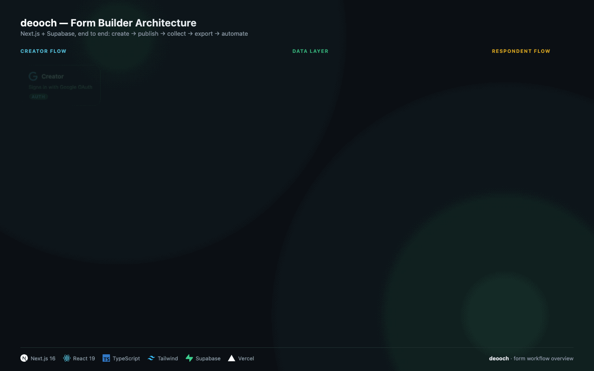

This is a [Next.js](https://nextjs.org) project bootstrapped with [`create-next-app`](https://nextjs.org/docs/app/api-reference/cli/create-next-app).

## Architecture



- **Creator flow** — sign in with Google via Supabase Auth → build forms in the Next.js/React Form Studio → forms are saved to Supabase Postgres.
- **Data layer** — Supabase Postgres is the source of truth (forms, fields, tokens, RLS policies).
- **Respondent flow** — anyone with the link opens the public `/f/[slug]` form (no login) and submits, which writes straight to Supabase.
- **Back to the creator** — submissions show up live in the dashboard, exportable as CSV/XLSX.
- **Automation** — an MCP server exposes forms and submissions over API tokens so AI agents can create forms or read responses programmatically.

Stack: Next.js 16, React 19, TypeScript, Tailwind CSS, Supabase (Postgres + Auth), deployed on Vercel.

## Getting Started

First, run the development server:

```bash
npm run dev
# or
yarn dev
# or
pnpm dev
# or
bun dev
```

Open [http://localhost:3000](http://localhost:3000) with your browser to see the result.

You can start editing the page by modifying `app/page.tsx`. The page auto-updates as you edit the file.

This project uses [`next/font`](https://nextjs.org/docs/app/building-your-application/optimizing/fonts) to automatically optimize and load [Geist](https://vercel.com/font), a new font family for Vercel.

## Learn More

To learn more about Next.js, take a look at the following resources:

- [Next.js Documentation](https://nextjs.org/docs) - learn about Next.js features and API.
- [Learn Next.js](https://nextjs.org/learn) - an interactive Next.js tutorial.

You can check out [the Next.js GitHub repository](https://github.com/vercel/next.js) - your feedback and contributions are welcome!

## Deploy on Vercel.

The easiest way to deploy your Next.js app is to use the [Vercel Platform](https://vercel.com/new?utm_medium=default-template&filter=next.js&utm_source=create-next-app&utm_campaign=create-next-app-readme) from the creators of Next.js.

Check out our [Next.js deployment documentation](https://nextjs.org/docs/app/building-your-application/deploying) for more details.
